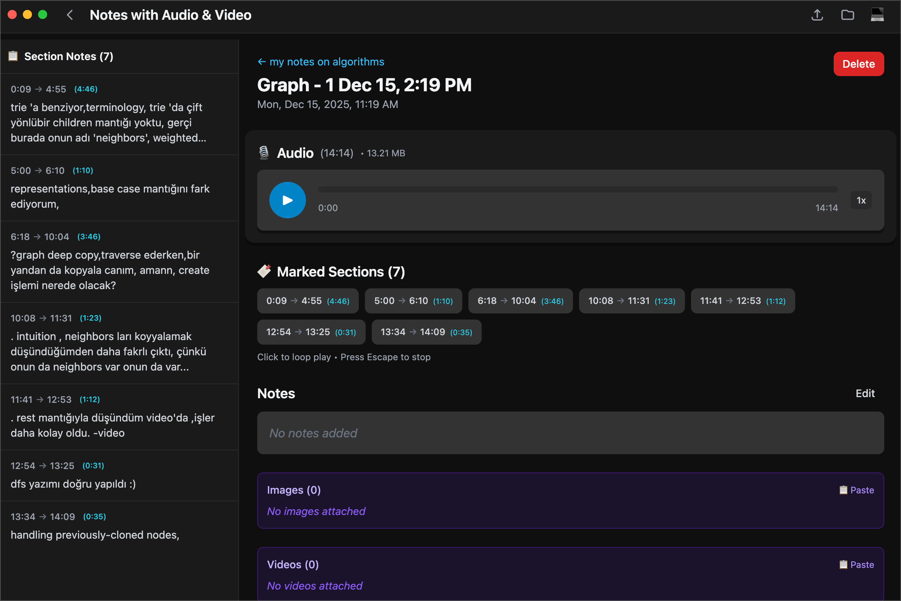
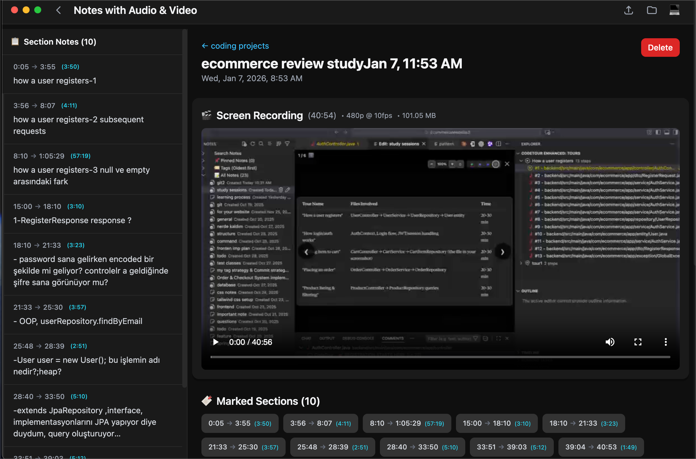
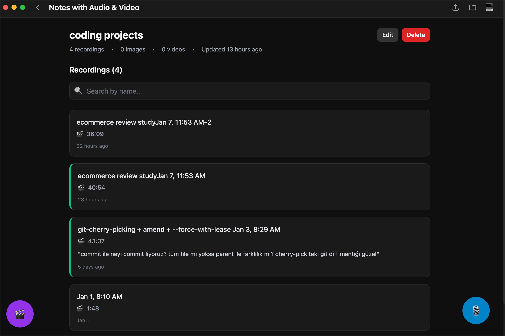

# Notes With Audio And Video

Audio notes organized by topics with image and video attachments built with Electron, React, and Vite.

## Features

- **Audio Recording & Playback** - Record audio notes with adjustable playback speed and pitch control
- **Video & Screen Recording** - Capture video and screen recordings using native macOS ScreenCaptureKit integration
- **Topic-Based Organization** - Organize your notes by topics for easy management and retrieval
- **Rich Text Notes** - Create detailed notes with rich text formatting and image attachments
- **SQLite Database** - Local storage using SQLite for fast, reliable data persistence
- **Cross-Platform** - Available for macOS, Windows, and Linux

## 📸 Screenshots

<div align="center">

### Audio Recording Note


*Record audio notes with real-time waveform visualization and playback controls*

---

### Video Recording Note


*Capture screen recordings with synchronized note-taking and video preview*

---

### Topic Recordings List


*Organize and manage all your audio and video recordings by topic*

</div>

## Installation

### macOS

1. Download the latest `.zip` file from the [Releases](https://github.com/mahmutsalman/notes-with-audio-and-video/releases) page
2. Extract the archive
3. Move the app to your Applications folder
4. Right-click the app and select "Open" (first time only)

### Windows

1. Download the latest `.exe` installer from the [Releases](https://github.com/mahmutsalman/notes-with-audio-and-video/releases) page
2. Run the installer
3. Follow the installation wizard

### Linux

1. Download the latest `.AppImage` from the [Releases](https://github.com/mahmutsalman/notes-with-audio-and-video/releases) page
2. Make it executable: `chmod +x Notes-With-Audio-And-Video.AppImage`
3. Run: `./Notes-With-Audio-And-Video.AppImage`

## Development

### Prerequisites

- Node.js 20 or higher
- npm
- Python 3 (for native module builds)
- macOS: Xcode Command Line Tools
- Windows: Visual Studio Build Tools
- Linux: Build essentials

### Setup

```bash
# Clone the repository
git clone https://github.com/mahmutsalman/notes-with-audio-and-video.git
cd notes-with-audio-and-video

# Install dependencies
npm install

# Rebuild native modules
npm run rebuild

# Run in development mode
npm run electron:dev
```

### Build

```bash
# Build for current platform
npm run build

# Build DMG for macOS
npm run build:dmg
```

### Project Structure

```
├── electron/           # Electron main process and native modules
│   ├── main.ts        # Main process entry point
│   ├── preload.ts     # Preload script
│   └── native/        # Native C++ modules (ScreenCaptureKit)
├── src/               # React frontend
│   ├── components/    # React components
│   ├── services/      # Database and business logic
│   └── App.tsx        # Application root
├── build/             # Build configuration and entitlements
└── dist/              # Build output
```

## Technologies

- **Frontend**: React 18, TypeScript, Tailwind CSS
- **Desktop**: Electron 33, electron-builder
- **Database**: better-sqlite3
- **Media**: howler.js, ffmpeg-static, react-quill
- **Build**: Vite, TypeScript, PostCSS

## Contributing

Contributions are welcome! Please read our [Contributing Guidelines](CONTRIBUTING.md) before submitting pull requests.

## Security

For security issues and vulnerability reporting, please see our [Security Policy](SECURITY.md).

## License

This project is licensed under the MIT License - see the [LICENSE](LICENSE) file for details.

## Code Signing

Code signing provided by [SignPath.io](https://signpath.io), certificate by [SignPath Foundation](https://signpath.org).

Windows executables are digitally signed to ensure authenticity and integrity. For more information about our code signing practices, see our [Code Signing Policy](docs/CODE_SIGNING_POLICY.md).

## Support

- **Issues**: [GitHub Issues](https://github.com/mahmutsalman/notes-with-audio-and-video/issues)
- **Email**: csmahmutsalman@gmail.com

---

Built with ❤️ by Mahmut Salman
